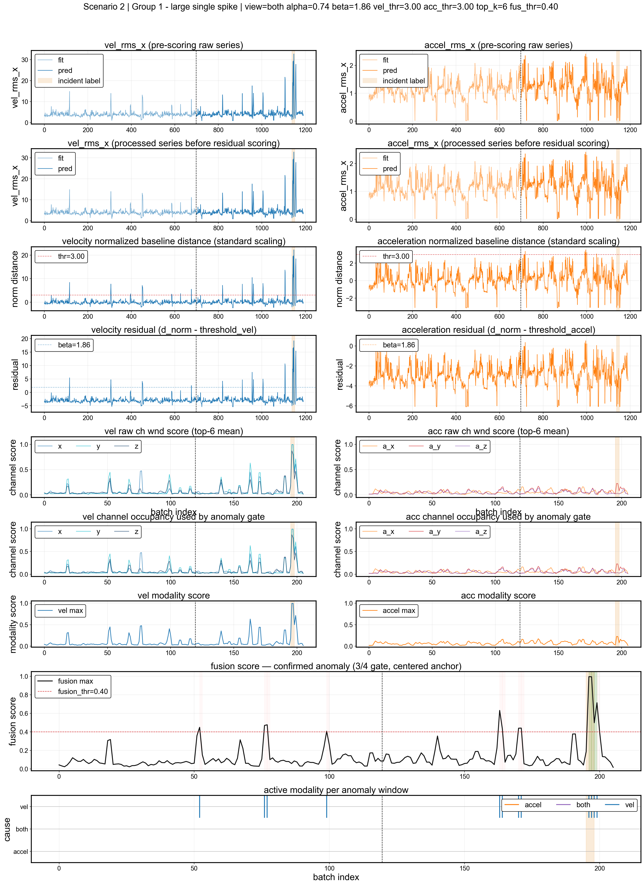

# Industrial Sensor Anomaly Detection API

This repository implements an anomaly detection API for industrial vibration sensor data. For each sensor scenario, the model learns what normal looks like from a private `fit` file, then replays a private `pred` file in 2-hour windows with a 1-hour stride.

The goal is simple: raise alarms for real event windows without reacting to every isolated spike. Most windows are normal, so false alarms matter as much as missed events.

This public repository does not include private datasets, private labels, external source materials, local assistant configuration, or fitted model artifacts. Generated reference figures are included as visual summaries of the private benchmark and do not include raw source data.

## Problem And Evaluation

Each scenario has two private files:

- A `fit` split used only to estimate normal sensor behavior.
- A `pred` split replayed as the evaluation stream.

The labels are private event windows. During evaluation, the API receives the `pred` split in overlapping batches and returns alarms. The evaluator checks whether those alarms match the labelled windows.

## Metric Scoring

The benchmark is scored by event window:

- **True positive:** at least one emitted alarm overlaps a labelled event window for an event scenario.
- **False negative:** no emitted alarm overlaps the labelled event window.
- **Partial coverage:** an alarm is emitted, but it does not cover enough of the event window.
- **False positive:** an alarm is emitted in a no-event scenario.
- **Precision:** of all alarms emitted, how many were correct.
- **Recall:** of all labelled events, how many were detected.
- **F1:** harmonic mean of precision and recall.

The final gate is simple: precision, recall, and F1 must each pass their threshold. The no-event scenarios are important because frequent false alarms make an alerting system hard to trust.

## Private Benchmark Results

The metrics below were produced on a private benchmark dataset that is not distributed with this repository.

| Metric | Value | Threshold | Status |
|---|---:|---:|---|
| Precision | **1.000** | 0.50 | Pass |
| Recall | **0.909** | 0.30 | Pass |
| F1 | **0.952** | 0.35 | Pass |

Zero false positives were observed across 7 no-event sensor scenarios. Four scenarios remained as tuning leads: 6 and 27 as missed detections, and 7 and 29 as partial event-window coverage.

## Repository Structure

```text
.
|-- src/
|   |-- sample_processing/
|   |   |-- api/                    # FastAPI endpoints and request contracts
|   |   |-- hyperparameters/        # Versioned YAML configuration
|   |   `-- model/
|   |       |-- anomaly_model.py     # Runtime model orchestration and param loading
|   |       |-- sensor_model.py      # Per-batch scoring pipeline
|   |       |-- baselines.py         # Runtime baseline fit/score helpers
|   |       |-- preprocessing.py     # Runtime spike clipping helper
|   |       |-- scenario_groups.py   # Shared sensor-scenario group mapping
|   |       `-- alerting/            # Alert engine internals
|   `-- analysis/
|       |-- api_replay/              # Offline replay and benchmark-style evaluation
|       |-- plotting/                # Notebook-facing plotting and widgets
|       `-- model_cache.py           # Versioned fitted-model cache helpers
|-- notebooks/
|   |-- 01_eda.ipynb
|   |-- 02_model_debugging.ipynb
|   |-- assets/                     # Maintained notebook source assets
|   `-- _generated/                 # Reference image exports
|-- data/                           # Private data placeholder
|-- labels/                         # Private label placeholder
|-- cache/                          # Local fitted-model cache placeholder
|-- compose.yaml
|-- Dockerfile
|-- Makefile
`-- README.md
```

The API code lives in `src/sample_processing`. The analysis code is used by the notebooks and the offline replay evaluator.

## Private Data Layout

The public repo ships without private benchmark files. To run the full private workflow locally, restore the files documented in [data/README.md](data/README.md) and [labels/README.md](labels/README.md).

Expected private inputs:

- `data/sensor_data_fit_{1..29}.parquet`
- `data/sensor_data_pred_{1..29}.parquet`
- `labels/incidents.yaml`

If these files are missing, the private benchmark tests cannot run. Restore the private files locally before running the benchmark command.

## How To Run

```bash
make run             # build and start the API on localhost:8000
make stop            # stop the Docker services
make inference-test  # main private benchmark gate and source of reported metrics
```

The primary evaluation command is:

```bash
make inference-test
```

Notebook `02_model_debugging.ipynb` uses the same private benchmark criteria and metrics. The other `make` commands are operational Docker helpers.

## Methodology

The pipeline has five main steps:

1. **Data loading and labelling.** Per-scenario fit / pred parquet files are concatenated, `uptime` is used as the operational gate, and `pred` rows are labelled against private event windows.
2. **Preprocessing.** `clip_rms_spikes(vel=100, accel=10)` clips large one-off spikes before scoring.
3. **Per-sensor baseline.** Each scenario's `fit` split defines its own healthy baseline. Residuals are measured in fit-healthy standard deviations.
4. **Scoring.** Residuals are converted into anomaly scores with group-specific settings from [norm_model_hyperparams.yaml](src/sample_processing/hyperparameters/norm_model_hyperparams.yaml).
5. **Alarm selection.** The alert engine decides whether the signal should produce an individual-channel alarm or a grouped alarm.

## Model And Alarm Setup

The model is intentionally small and easy to inspect. It does three things:

- Builds one healthy baseline per sensor from the `fit` data.
- Scores how far each `pred` batch moves away from that baseline.
- Aggregates the strongest samples in each 2-hour batch before deciding if an alarm should fire.

The example below shows one scenario from the private benchmark. The top rows compare `fit` and `pred`, the middle rows show the normalized distance from the baseline, and the bottom rows show how channel scores become a final fusion score.



Scenario 2 is useful because the model sees many anomalous points, not just one clean spike. The alert layer uses that stream of detections as input, then decides when an alarm is worth emitting.


In this replay, the model produces many anomaly markers, but the API does not alert on every one of them. Pending states, grouped-channel confirmation, and cooldown rules turn the noisy detection stream into a small number of alerts at the relevant moment.

More exported examples are available in [notebooks/_generated/widget_exports](notebooks/_generated/widget_exports), including sigmoid-scoring views and API replay views for the private benchmark scenarios.

After scoring, the alarm logic groups related channels so the API does not emit a separate alarm for every sensor axis. The hierarchy image shows the rule of thumb: start with individual channel alarms, promote to a grouped alarm when related channels move together, and use reset/cooldown rules to avoid reporting the same event repeatedly.


## Model And Alerting Improvements

| Aspect | Baseline | Current |
|---|---|---|
| Detector config | Single global velocity-norm z-score model | Four group-specific configurations |
| Features | Velocity RMS collapsed to one norm | Residual-space scoring on raw RMS channels |
| Scoring rule | Absolute z-score against one healthy mean/std | Group-tuned sigmoid on residuals |
| Window aggregation | Fraction of anomalous samples in the batch | Top-K occupancy on the outer 2h batch |
| Alert state | Single lock | Tiered ownership with confirmation, cooldown, holdback, and reset logic |

In short: the baseline model finds unusual movement, and the alarm hierarchy decides whether that movement is strong enough and coordinated enough to report.

## Reproducibility

- Hyperparameters are versioned in `src/sample_processing/hyperparameters/`.
- Fitted models are written locally under `cache/models/v{N}/`; these `.pkl` artifacts are ignored.
- `METRICS.md` is ignored for local/private report experiments.
- Reference visualizations in `notebooks/_generated/` are intentionally kept in the public repo.

## License

This project is released under the MIT License. The license applies to the code and documentation in this repository, not to private datasets, labels, external source materials, or fitted model artifacts.
