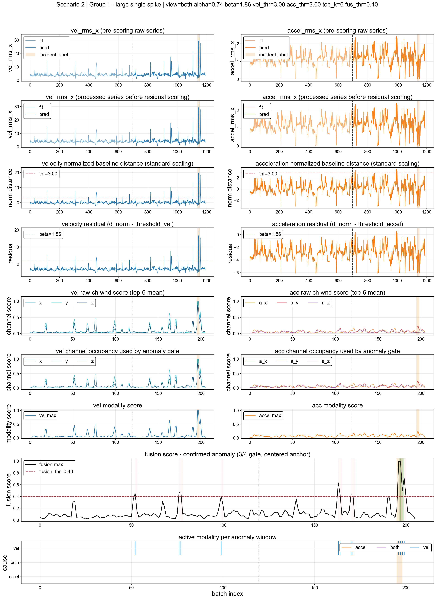
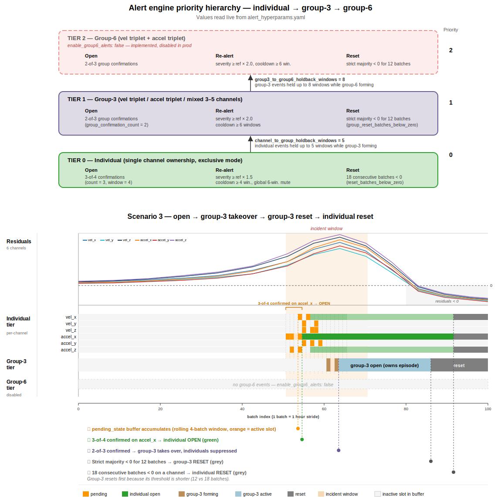
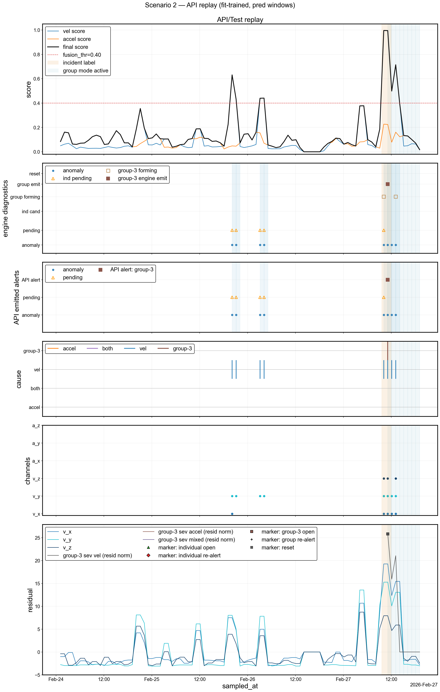
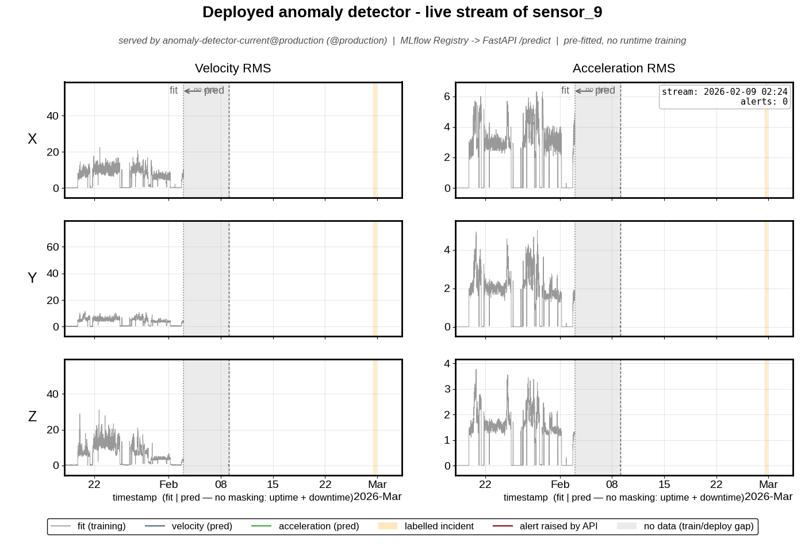

# Industrial Sensor Anomaly Detection API

[](https://github.com/pirao/AnomalyDetection2026/actions/workflows/ci.yml)

> A FastAPI service that turns industrial vibration-sensor data into timely, trustworthy fault alarms.

## What it does

Industrial machines rarely fail without warning. Their vibration sensors pick up the early signs of a developing fault long before it shows on the factory floor, and this service turns those signals into timely alarms.

Its job is to catch genuine faults while ignoring the harmless spikes. Every served model comes from the MLflow registry and is loaded once at startup, and `/ready` plus `/metadata` report exactly which version is live, so the service is never a black box.

> This public repository ships without the private datasets or labels. The figures, the demo GIF, and the trained MLflow registry (`mlflow.db` + `mlruns/`) are committed so the results stay visible and the service runs out of the box.

## How it works

### How performance is judged

Each sensor has two private data splits. A `fit` split captures normal operation, and a `pred` split is replayed as the live evaluation stream. Labelled incident windows mark when real faults actually happened. Alarms are scored by event window rather than by individual sample, which is what the design is tuned for.

- **True positive.** An alarm overlaps a labelled fault window.
- **False negative.** A fault window passes with no alarm.
- **False positive.** An alarm fires in a scenario that has no fault.

Catching each real incident once while staying silent the rest of the time is the goal every design choice below serves.

### The detector

The detector is deliberately small, so every alarm can be traced to a cause. It works in three stages:

1. **Learn what healthy looks like.** A sensor's normal-operation period sets its baseline, and every later reading is measured as a distance from it. Working in each sensor's own units lets one design cover sensors with very different normal ranges.
2. **Score how abnormal a window is.** Each deviation passes through a tuned curve that rises sharply once a signal leaves its normal range, and only the most abnormal samples are combined into one score. Using just the strongest samples stops a brief spike from dominating.

   The plot below shows what this looks like for scenario 2: each row is a signal channel, and the scores rise sharply once a channel enters its anomalous regime.

   

3. **Decide whether to alarm.** The raw score stream is noisy, so the engine waits for a deviation to repeat across several windows before firing, then stays quiet through a cooldown. One fault yields one alarm instead of a burst.

   The diagram below shows how the three escalation levels interact: a single channel feeds into a group-3 pattern (same modality), which feeds into group-6 (full cross-modal). Group-6 is implemented but disabled by default — group-3 already catches every incident within the current dataset's window lengths.

   

That last step is the difference between the baseline's scattered alarms and the current model's clean, well-timed set. The replay below shows the full pipeline on scenario 2 — scoring, alert timing, and where the confirmed alarm lands relative to the labelled incident window.



### What changed from the baseline

The current model replaces a single global detector with per-group residual scoring and a stateful alert engine. Each row below is one of those upgrades.

| Aspect | Baseline | Current |
|---|---|---|
| Detector | One global velocity-norm z-score | Group-specific residual detectors |
| Features | Velocity RMS collapsed to one norm | Residual scoring on all RMS channels |
| Aggregation | Fraction of anomalous samples | Strongest samples per 2-hour window |
| Alert logic | Single lock | Stateful engine: confirmation, cooldown, reset |

## Repository structure

```text
AnomalyDetection2026/
|-- src/
|   |-- sample_processing/              # deployable service package
|   |   |-- api/                        # FastAPI: /fit, /predict, /health, /ready, /metadata, /metrics
|   |   |-- serving/                    # registry bundle + @production loader
|   |   `-- model/                      # baseline/current detectors and alert engines
|   |
|   |-- analysis/                       # offline-only evaluation, MLflow, plotting helpers
|   `-- tests/                          # contract, model, evaluation, performance tests
|
|-- notebooks/                          # exploratory data analysis and model debugging
|-- data/raw/                           # private immutable parquet files and labels (not committed)
|-- reports/figures/                    # generated plots, screenshots, GIFs
|-- cache/                              # fitted-model artifacts for offline replay (committed)
|-- mlflow.db                           # MLflow backend store: runs, model versions, @production alias
|-- mlruns/                             # MLflow artifact store: the registered pyfunc bundle
|
|-- Dockerfile
|-- compose.yaml
|-- Makefile
`-- pyproject.toml
```

## Quick start

Every workflow is a `make` target that wraps a `docker compose` command, so you never touch Docker flags directly. Each target rebuilds its own image, so source edits are always picked up.

| `make` target | Wraps (`docker compose`) | What it does | Requires |
|---|---|---|---|
| `make run` | `up --build api` | Builds and starts the API + mlflow server on `localhost:8000` | `mlflow.db` + `mlruns/` present |
| `make demo` | `run --rm --build notebooks … deploy_demo` | Replays sensor 9 through the **running** API and regenerates `reports/figures/mlflow/deploy_demo.gif` | `make run` active + private data |
| `make demo-sensor SENSOR=N` | same, with `--sensor N` | Replays any sensor (`N` = scenario id) | `make run` active + private data |
| `make test` | `run --rm --build test` | Fast test suite: unit, contract, performance | private data for contract/performance (auto-skipped without it) |
| `make inference-test` | `run --rm --build inference-test` | 29-scenario benchmark (~15 min); the source of the numbers in [Results](#results) | private data |
| `make notebooks` | `up --build notebooks` | JupyterLab on `localhost:8888` with notebooks/cache mounted | — |
| `make stop` | `down` | Stops all Compose services | — |
| `make help` | — | Lists every target | — |

### Run the deployment

`make run` and `make demo` are the deployment path. Start the service first, then drive it:

```bash
make run     # terminal 1: brings up the api + mlflow services on localhost:8000
make demo    # terminal 2: replays sensor 9 through the running API, writes the GIF
```

To replay a different sensor, pass the scenario id:

```bash
make demo-sensor SENSOR=5   # replays sensor 5; any id from 1–29 is valid
```

`make demo` and `make demo-sensor` run inside the `notebooks` image and reach the API over the Compose network as `http://api:8000`, not `localhost`, which is why `make run` must be up first.

### Testing

- **`make test`** runs the fast suite: unit tests, API contract tests, and a concurrency/performance pass. Without private data only the unit tests run; the others skip automatically.
- **`make inference-test`** replays all 29 scenarios through the API end-to-end and takes about 15 minutes. This is the source of the precision/recall/F1 numbers in [Results](#results). A few per-scenario assertions are expected to fail by design; see the failure analysis in [notebooks/1.01-acp-model-debugging.ipynb](notebooks/1.01-acp-model-debugging.ipynb) for the full breakdown of scenarios 6, 7, 27, and 29.

### Working with private data

Restore the private files described in [data/raw/README.md](data/raw/README.md) and [data/raw/labels/README.md](data/raw/labels/README.md) before running `make demo`, `make test`, `make inference-test`, or the notebooks. The aggregate F1 gate clearing 0.85 is the result that matters; the notebook above explains why a handful of per-scenario assertions fall short of that.

## Results

On the 29-scenario benchmark the current model is both more precise and more complete than the baseline.

| Metric | Baseline | Current |
|---|---:|---:|
| Precision | 0.286 | **1.000** |
| Recall | 0.273 | **0.909** |
| F1 | 0.279 | **0.952** |

The baseline emitted 21 alarms with several false positives across no-event scenarios. The current model emits 29 alarms at about 0.79 alert efficiency, with zero false positives.

## Model lifecycle and serving

### From experiment to production

The path from a candidate model to a live one is four explicit steps, each leaving a record you can audit or roll back.

1. **Track every candidate.** Baseline and current models run in the `baseline-vs-current` experiment, logging metrics, parameters, and dataset fingerprints so any run can be reproduced and compared.
2. **Register the winner as one bundle.** The 29 per-sensor fitted models are packaged into a single pyfunc bundle named `anomaly-detector-current`, so the whole fleet is versioned and shipped as a unit.
3. **Promote with an alias.** The `@production` alias points at exactly one version. Promotion and rollback are a single alias move, with no rebuild.
4. **Serve from the alias.** The API resolves `models:/anomaly-detector-current@production` at startup and scores every request from memory afterward.

### Serving architecture

Because the bundle is loaded once, request scoring never calls MLflow. The registry is a deployment-time dependency, not a request-time one, which keeps scoring fast and keeps the API working even if MLflow later goes down.

```text
          docker compose
  +------------+   load @production    +-----------------------+
  |    api     | --------------------> |  mlflow server :5000  |
  |  FastAPI + |                       |  backend: mlflow.db   |
  |  mlflow    | <-------------------- |  artifacts: mlruns/   |
  |   :8000    |     pyfunc bundle     +-----------------------+
  +------------+
```

| Endpoint | Question it answers | Behavior |
|---|---|---|
| `GET /health` | Is the process alive? | always `200 {"status": "ok"}` |
| `GET /ready` | Can it serve the registered model? | `200` once the bundle loads, else `503` |
| `GET /metadata` | Which model, with what provenance? | registry version, fingerprint, git sha, F1 |
| `GET /metrics` | Prometheus scrape target | request counter + latency histogram |

### Inspect the running service

With `make run` active in another terminal, use these endpoints to inspect the service:

```bash
curl localhost:8000/health      # liveness: always 200 {"status": "ok"}
curl localhost:8000/ready       # readiness: 503 until the @production bundle loads, then 200
curl localhost:8000/metadata    # which model version is serving, with provenance
curl localhost:8000/metrics     # Prometheus exposition
# open localhost:8000/docs      # interactive Swagger UI for /fit and /predict
```

The served bundle already contains all 29 pre-fitted models. `POST /predict` with `sensor_id: "sensor_8"` scores against scenario 8's fitted model directly, with no `/fit` step. `/fit` only registers a new sensor the bundle does not already cover.



## License

Released under the MIT License.
