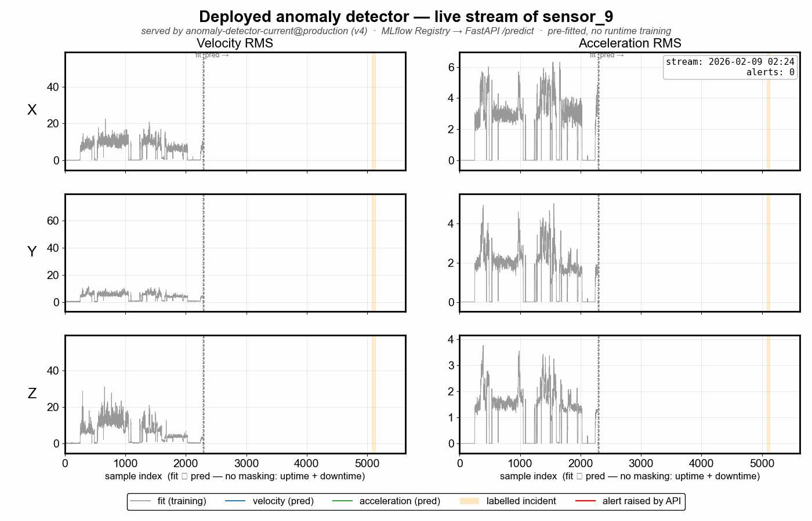

# Industrial Sensor Anomaly Detection API

A FastAPI service that detects faults in industrial vibration sensors. For each sensor it learns "normal" from a private `fit` file, then scores a private `pred` stream in 2-hour windows (1-hour stride) and raises alarms for real fault windows — without reacting to every isolated spike. The full lifecycle (track → register → promote → serve) is managed with MLflow.

> This public repo ships without the private datasets, labels, or fitted artifacts. Reference figures are included as visual summaries only.

## Repository Structure

```text
AnomalyDetection2026/
├── src/
│   ├── sample_processing/              # deployable service (lean runtime image)
│   │   ├── api/
│   │   │   └── main.py                 # FastAPI: /fit, /predict, /health; loads @production at startup
│   │   └── model/
│   │       ├── baseline/               # single-feature z-score detector + simple alert engine
│   │       │   ├── anomaly_model.py
│   │       │   ├── alert_engine.py
│   │       │   └── hyperparameters/model_hyperparams.yaml
│   │       ├── current/                # residual-space detector + tiered alert engine
│   │       │   ├── anomaly_model.py
│   │       │   ├── sensor_model.py
│   │       │   ├── normalization.py
│   │       │   ├── preprocessing.py
│   │       │   ├── alerting/           # engine, group_logic, priority_queue
│   │       │   └── hyperparameters/    # norm_model_hyperparams.yaml, alert_hyperparams.yaml
│   │       ├── shared/
│   │       │   └── pipeline_hyperparams.yaml
│   │       └── scenario_groups.py      # sensor → scenario-group routing
│   ├── analysis/                       # offline only — not imported by the runtime service
│   │   ├── evaluation/                 # API-replay benchmark: batching, incidents, simulation, metrics
│   │   ├── mlflow/                     # tracking, registry, model cache, deployment demo
│   │   │   ├── mlflow_experiments.py   # run logging + baseline-vs-current comparison
│   │   │   ├── mlflow_registry.py      # register, promote alias, load_for_serving
│   │   │   ├── model_cache.py          # fingerprinted artifact cache
│   │   │   └── deploy_demo.py          # generates notebooks/_images/mlflow/deploy_demo.gif
│   │   └── plotting/                   # notebook visualisation widgets
│   │       ├── scoring/                # sigmoid scoring + API replay widgets
│   │       ├── eda/                    # RMS and scenario inspector widgets
│   │       ├── reporting.py            # md_table, plot_confusion (seaborn; notebook-only)
│   │       └── style.py                # set_plot_style() — shared serif rcParams
│   └── tests/                          # contract, model, evaluation, performance tests
├── notebooks/
│   ├── 01_eda.ipynb                    # exploratory data analysis
│   ├── 02_model_debugging.ipynb        # model development, scoring, evaluation
│   └── _images/                        # exported figures
│       ├── mlflow/                     # deploy_demo.gif, experiments.png, registry.png
│       └── widget_exports/             # sigmoid scoring + API replay exports (all 29 scenarios)
├── data/                               # private sensor parquet files (see data/README.md)
├── labels/                             # private incident labels (see labels/README.md)
├── cache/                              # fitted model artifacts, .pkl ignored (see cache/README.md)
├── Dockerfile
├── compose.yaml
├── Makefile
└── pyproject.toml
```

## Problem And Evaluation

Each scenario has a private `fit` split (used only to estimate normal behavior) and a `pred` split that is replayed as the evaluation stream. Labels are private fault windows. The API receives `pred` in overlapping batches and returns alarms; the evaluator scores them **by event window**:

- **True positive** — an alarm overlaps a labelled fault window.
- **False negative** — no alarm overlaps the window.
- **False positive** — an alarm fires in a no-event scenario.

Precision, recall, and F1 summarize these. No-event scenarios matter as much as faults: frequent false alarms make an alerting system untrustworthy.

## Results: Baseline vs Current

Measured on the private benchmark. The current model replaces a single global velocity z-score with four group-specific residual-space detectors plus a tiered alert engine.

| Metric | Baseline | Current |
|---|---:|---:|
| Precision | 0.286 | **1.000** |
| Recall | 0.273 | **0.909** |
| F1 | 0.279 | **0.952** |

**Alarm quality:** the baseline emitted 21 alarms — only ~6 useful, with 4 false positives across the 7 no-event scenarios. The current model emits 29 alarms at ~0.79 efficiency with **zero false positives**. Remaining tuning leads: scenarios 6 and 27 (missed), 7 and 29 (partial coverage).

## Model

The detector is intentionally small and inspectable:

1. **Baseline per sensor.** Each scenario's `fit` split defines its healthy mean/std; residuals are measured in those units.
2. **Scoring.** Residuals pass through a group-tuned sigmoid; the strongest samples in each 2-hour batch are aggregated (top-K occupancy) into one fusion score. Group settings live in [norm_model_hyperparams.yaml](src/sample_processing/model/current/hyperparameters/norm_model_hyperparams.yaml).
3. **Alarm selection.** A tiered engine turns the noisy detection stream into a few well-timed alarms using per-channel confirmation, grouped-channel promotion, cooldown, and reset rules.

| Aspect | Baseline | Current |
|---|---|---|
| Detector | One global velocity-norm z-score | Four group-specific residual detectors |
| Features | Velocity RMS collapsed to one norm | Residual-space scoring on all RMS channels |
| Aggregation | Fraction of anomalous samples | Top-K occupancy on the 2h batch |
| Alert state | Single lock | Tiered ownership: confirmation, cooldown, holdback, reset |


The model produces many anomaly markers, but the API does not alert on every one — the alert layer decides when movement is strong and coordinated enough to report.


More exported scenarios are in [notebooks/_images/widget_exports](notebooks/_images/widget_exports).

## MLflow Tracking, Registry And Deployment

The model lifecycle runs end to end on MLflow (tracking + registry, SQLite-backed at `mlflow.db`).

- **Track.** Baseline and current are evaluated through the exact FastAPI path and logged as comparable runs in the `baseline-vs-current` experiment (metrics, params, dataset) — so shipping the current model is evidence-backed (see Results above).
- **Register.** The 29 per-sensor fitted models are packaged into **one** pyfunc bundle registered as `anomaly-detector-current` — one model, not 29, because the sensors are calibrations of the same detector routed by `sensor_id`. Each version carries the data/config/git **fingerprint** tying it to the exact run that validated it.
- **Promote.** Deployment is an **alias** move (`@production`) — promotion or rollback is one line, no code change.
- **Serve.** The FastAPI service loads the `@production` bundle once at startup (pre-fitted — **no runtime training**); if the registry is unavailable it degrades to runtime-fit (`/fit` + `/predict`).


Below, the deployed service replays `sensor_9` through `/predict`; the `@production` model raises a single alert that lands inside the labelled incident window — produced entirely from the registry, with no runtime fit.



## How To Run

```bash
make run             # build + start the API on localhost:8000
make inference-test  # private benchmark gate and source of the reported metrics
make stop            # stop the Docker services

mlflow ui --backend-store-uri sqlite:///mlflow.db        # browse experiments + registry
python -m analysis.mlflow.deploy_demo --sensor 9         # regenerate the deployment GIF
```

Restore the private files in [data/README.md](data/README.md) and [labels/README.md](labels/README.md) before running the benchmark. Notebook `02_model_debugging.ipynb` uses the same criteria.

## Reproducibility And License

Hyperparameters are versioned under `src/sample_processing/model/.../hyperparameters/`; fitted models are cached locally under `cache/models/v{N}/` (`.pkl` ignored); MLflow runs and registry live in `mlflow.db`. Reference figures in `notebooks/_images/` are kept in the repo.

Released under the MIT License — applies to the code and documentation here, not to private datasets, labels, or fitted artifacts.
